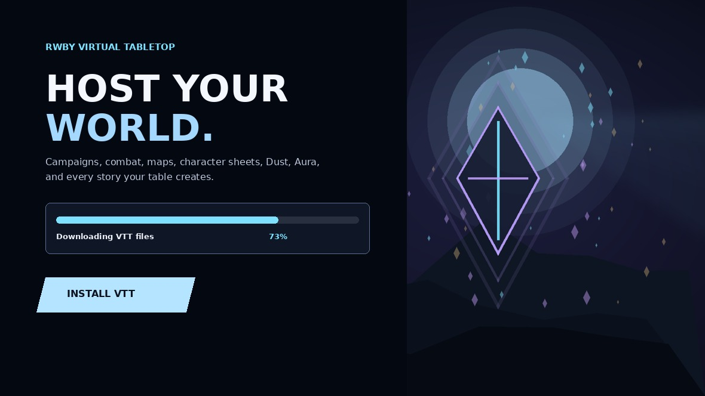

# Vivid Realms Launcher

The desktop installer, updater, and host launcher for **[Vivid Realms VTT](https://github.com/browerg/dnd-vtt)** —
a virtual tabletop for running D&D 5e and RWBY *Remnant* campaigns.

The VTT itself is a self-hosted web app. This launcher exists so hosting a game night
doesn't require a terminal: one window, one **Start Hosting** button, and a link you can
paste to your players.

> **Host your world.**



## What it does

**Installs and updates the game.** Pulls the VTT from the `rwby-theme` branch of the
[dnd-vtt](https://github.com/browerg/dnd-vtt) repo with real byte-level download
progress, then runs extraction, dependency install, build, and verification as staged
steps. Checks GitHub for newer launcher builds (`launcher-v*` releases) and can install
them in place.

**Sets up its own runtime.** Uses a bundled `cloudflared` from `resources/runtime` when
present, and otherwise provisions Node.js LTS and Cloudflare Tunnel through `winget`, so
a first-time host doesn't need anything preinstalled.

**Puts the table online.** Starts the VTT server, runs `cloudflared tunnel --url`,
scrapes the generated `*.trycloudflare.com` address out of the process output, and
surfaces it as a one-click invite link. No port forwarding, no router config.

**Protects campaigns.** Backs up `server/data` and the uploads directories into a
versioned `vivid-realms-backup` archive before updating, and restores from one on
demand. Uninstalling keeps campaign data by default.

**Announces sessions to Discord.** Optional incoming-webhook integration posting when a
session starts and ends. The webhook URL is entered by the user and stored in the app's
own settings directory — nothing is committed here.

**Two host modes.** Production serves the built client on `:3001`; development mode runs
the Vite dev server on `:5173` for working on the VTT itself.

## Layout

| Path | What it is |
|---|---|
| `src/main.js` | Electron main process — install, update, backup, tunnel, Discord, IPC |
| `src/preload.js` | Context-isolated bridge exposing the `launcher:*` IPC surface |
| `src/renderer.js` | Launcher UI logic |
| `src/index.html` | Launcher window markup |
| `src/styles.css` | Launcher styling |
| `assets/hero.jpg` | Window background art |
| `build/icon.ico` | Installer and app icon |

## Developing

```bash
npm install
npm start
```

Or double-click `PREVIEW-LAUNCHER.bat`, which does the same thing without installing.

## Building the installer

```bash
npm run dist
```

Produces a Windows NSIS installer (`Vivid-Realms-VTT-Setup-<version>.exe`) in `dist/`
via electron-builder. `BUILD-LAUNCHER.bat` wraps the same command.

Note that `runtime/` is gitignored — drop `cloudflared.exe` (and any bundled Node) in
there before building if you want them shipped as `extraResources`.

## Stack

Electron on Node built-ins only — no third-party runtime dependencies; electron and
electron-builder are dev-only. Updates go through the GitHub REST API, with rate-limit
handling and a short result cache so repeated checks don't hammer it. Tunnelling is
delegated to `cloudflared`.

## Note on artwork

`assets/hero.jpg` is a RWBY world map and is the intellectual property of Rooster Teeth.
It is used here as local background art for a personal, non-commercial fan project and
is not covered by this repository's license.
